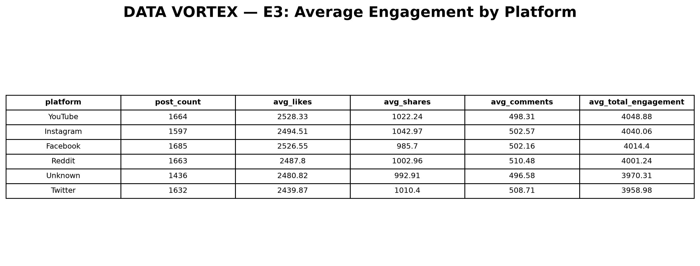
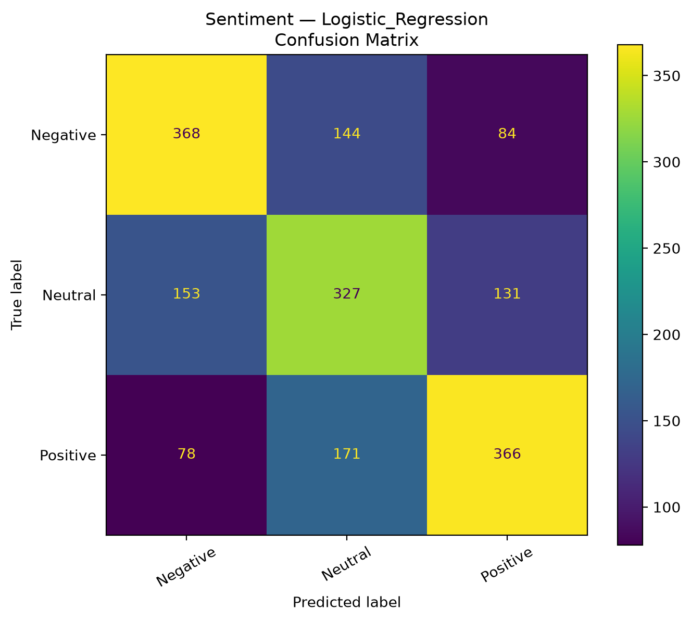
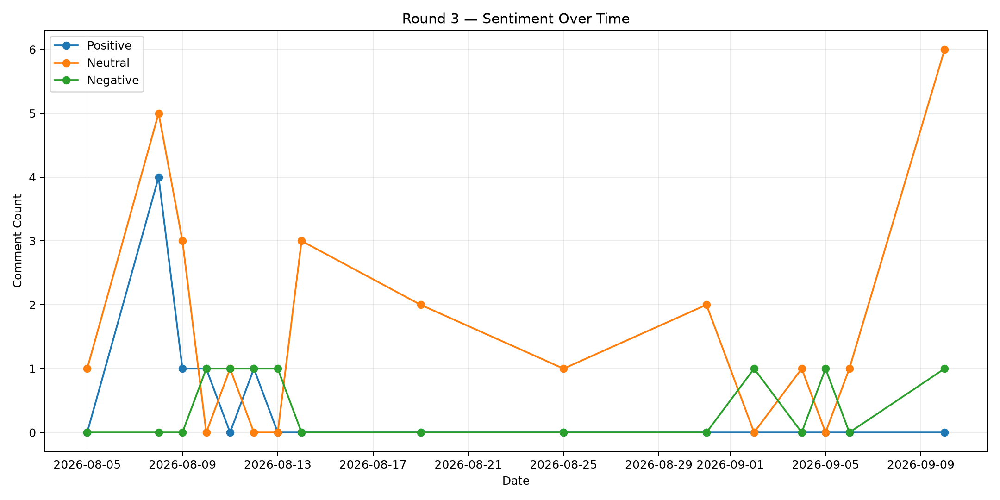
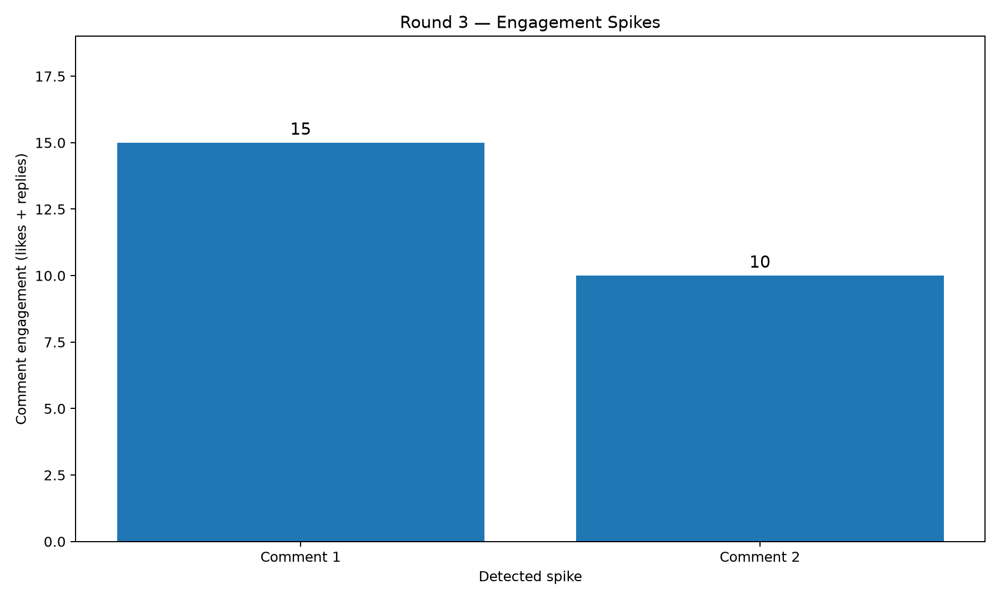

<div align="center">

# 🌐 Data Vortex A'26

### Rebuilding the Social Engine


**From Raw Social Data → Machine Learning → NLP → Social Signals**


### 👥 Team `soumadipd43`

**Soumadip Das** · IT · Team Head &nbsp; | &nbsp; **Aritra Pal** · CSE — AI & ML

**Haldia Institute Of Technology**

</div>

---

## 🚀 About the Project

**Data Vortex A'26** was a multi-round data science and AI challenge by **Aaruush**, built around the theme **"Rebuilding the Social Engine."**

Across three rounds, we moved from structured social-media data and SQL analysis to machine learning, NLP, and finally independently collected public social-media data.

### Our Journey

**📊 Data & SQL → 🤖 Machine Learning & NLP → 🌐 Real-World Social Signals**

| Round | Focus | What We Built |
|:---:|---|---|
| **01** | 📊 Data + SQL | Engagement, location & user-behaviour analysis |
| **02** | 🤖 ML + NLP | Sentiment & topic classification |
| **03** | 🌐 Social Signals | Sentiment shifts, engagement spikes & topic analysis |

---

# 📊 Round 1 — Data & SQL

### The Challenge

We analysed structured social-media data using **SQL and Python** to uncover engagement patterns and unusual user behaviour.

### What We Analysed

- **Platform Engagement** — average likes, shares, comments and total engagement
- **Location Engagement** — locations generating higher engagement
- **High-Impact Users** — users showing unusually high engagement relative to follower count

### Key Analyses

| Analysis | Focus |
|---|---|
| **E3** | Platform engagement |
| **M1** | Location-based engagement |
| **H6** | High-impact user behaviour |

### Platform Engagement



**Tech:** `Python` `Pandas` `SQLite` `SQL`

---

# 🤖 Round 2 — NLP & Machine Learning

Round 2 moved from analysing numbers to understanding **what people were actually saying**.

### The Challenge

We built NLP pipelines for:

- Sentiment classification
- Topic classification
- Text preprocessing
- Feature engineering
- Model evaluation
- Error analysis

### Models Explored

`Logistic Regression` · `Linear SVM` · `Naive Bayes` · `TF-IDF` · `DistilBERT`

---

## 💬 Sentiment Classification

After experimenting with multiple approaches, we trained a **DistilBERT-based sentiment classifier**.

### Results

| Metric | Result |
|---|---:|
| Accuracy | **68.33%** |
| Macro F1 | **67.81%** |
| Weighted F1 | **67.77%** |

**Classes:** `Negative` · `Neutral` · `Positive`

### Model Evaluation



---

## 🏷️ Topic Classification

Our final topic classifier combined **word + character TF-IDF** features with Logistic Regression.

### Results

| Metric | Result |
|---|---:|
| Accuracy | **93.52%** |
| Macro Precision | **92.92%** |
| Macro Recall | **56.30%** |
| Macro F1 | **65.52%** |
| Weighted F1 | **92.30%** |

---

# 🌐 Round 3 — Real-World Social Signals

For Round 3, we moved outside the provided datasets.

### The Challenge

We independently collected **public YouTube comments** discussing a platform monetisation change and applied our Round 2 NLP model to the discussion.

We used the **YouTube Data API v3** for data collection.

### What We Analysed

- 💬 Sentiment
- 📈 Sentiment shifts over time
- 🔥 Engagement spikes
- 🏷️ Topics
- 🔎 Entities
- ⚡ Possible discussion triggers

### Pipeline

**YouTube API → Collection → Filtering → NLP → Time Analysis → Social Signals**

---

## 📊 Final Dataset

| Metric | Result |
|---|---:|
| Comments | **40** |
| Videos | **12** |
| Duplicate Comments | **0** |
| Sentiment Classes | **3** |
| Engagement Spikes | **2** |

**Analysis period:** `5 August 2026 → 10 September 2026`

---

## 📈 Sentiment Analysis

The Round 2 DistilBERT model was applied to the collected comments to analyse sentiment over time.

### Sentiment Distribution

| Sentiment | Count |
|---|---:|
| 🔴 Negative | **7** |
| ⚪ Neutral | **26** |
| 🟢 Positive | **7** |

### Sentiment Over Time



---

## 🔥 Engagement Analysis

Comment engagement was calculated as:

**Engagement = Likes + Replies**

| Metric | Value |
|---|---:|
| Mean Engagement | **2.35** |
| Median Engagement | **1.50** |
| Spike Threshold | **8.32** |
| Highest Engagement | **15** |
| Second Highest | **10** |

### Engagement Spikes

Two comments crossed the engagement-spike threshold.



---

## 🏷️ Discussion Topics

| Topic | Share |
|---|---:|
| Eligibility & Access | **27.5%** |
| Original Content & Reposts | **25.0%** |
| Monetisation Rules | **15.0%** |
| Payouts & Earnings | **12.5%** |
| Impressions & Reach | **12.5%** |
| Small Creators | **10.0%** |

### Entities

| Entity | Share |
|---|---:|
| X / Twitter | **25.0%** |
| Pakistan | **15.0%** |
| 500K Impressions | **7.5%** |
| Original Content Rewards | **5.0%** |
| Elon Musk | **2.5%** |

---

# 🛠️ Technology Stack

<div align="center">

**Python · SQL · Pandas · NumPy · SQLite · Scikit-learn · TF-IDF · DistilBERT · Hugging Face · YouTube Data API · Git · GitHub**

</div>

---

# 📁 Project Structure

```text
Data-Vortex/
│
├── sql/                  # Round 1 SQL analysis
│   └── outputs/
│
├── round2/               # NLP & ML pipeline
│   ├── data/
│   ├── models/
│   ├── notebooks/
│   ├── outputs/
│   └── reports/
│
├── round3/               # Real-world social analysis
│   ├── data/
│   ├── scripts/
│   ├── notebooks/
│   ├── outputs/
│   └── reports/
│
├── round4/               # Round 4 preparation
│   ├── data/
│   ├── dashboard/
│   ├── outputs/
│   └── reports/
│
├── .env.example
├── .gitignore
└── README.md
```
## 💡 What We Learned

> **Real-world data rarely behaves like a clean benchmark dataset.**

Working through Data Vortex meant dealing with noisy data, class imbalance, irrelevant search results, model uncertainty and small samples.

The biggest lesson wasn't simply how to train another model — it was learning to **question what the data actually supports before trusting the result.**

<div align="center">

### Raw Data → SQL → ML → NLP → Social Signals → Insights

</div>

---

## 👥 Team

| | |
|---|---|
| **Aritra Pal** | CSE — Artificial Intelligence & Machine Learning |
| **Soumadip Das** | IT — Information Technology \| Team Head |
| **Institute** | Haldia Institute Of Technology |
| **Team** | `soumadipd43` |

---

<div align="center">

### 🌐 Data Vortex A'26

**Rebuilding the Social Engine.**

**No trophy this time. But definitely a lot of progress**

</div>
